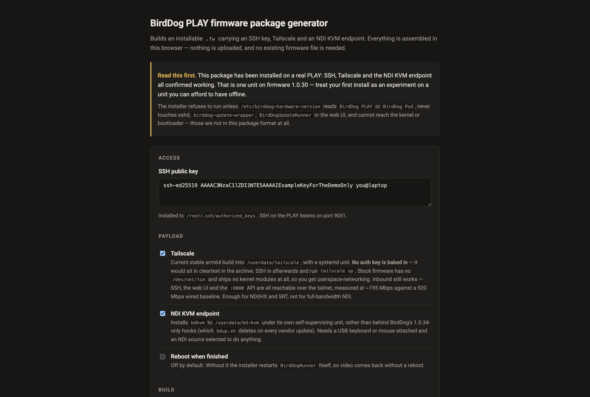

# BirdDog PLAY Patcher user guide

Builds an installable `.fw` for a [BirdDog PLAY](https://birddog.tv) that adds **an SSH key,
Tailscale, an NDI KVM endpoint, and a USB media player** — so a PLAY can be reached and managed
remotely, can drive the machine it is displaying, and can play video, stills and PDFs off a USB
stick.

**The package is assembled entirely in your browser.** Nothing is uploaded, no account is needed,
and **you do not need your existing firmware file** — the generated package is a standalone overlay
installer, not a modified copy of BirdDog's firmware.

> **Before you rely on this:** the package format was derived by static analysis of the stock
> updater, and the resulting package **has been installed on a real BirdDog PLAY** — SSH, Tailscale
> and the NDI KVM endpoint are all confirmed working on hardware, and the archive writer is checked
> byte for byte against `tar` in CI.
>
> **That is one unit on one firmware version.** It has not been tested across the range of PLAY and
> Pod firmwares in the field.
>
> This codebase was created with AI assistance, directed and reviewed by a human author.

---

## Why there is no upload and no decryption

BirdDog's updater extracts the uploaded archive and runs its `update` script **as root**. There is
**no signature check anywhere in that chain**.

So a valid package is simply a gzipped tar with an executable `update` at the top level — and ours
is **a readable bash script rather than a vendor binary.**

That is the whole reason this tool can be a static page: there is no payload to decrypt and no key
involved, so there is nothing to upload and nothing to protect server-side.

**This project contains no BirdDog firmware, no vendor keys, and no way to decrypt one.**

> **Read the installer before you run it.** It is 200 lines of commented bash, it runs as root on
> your device, and you should not take anyone's word for what it does.

---

## What gets installed

| Path | What | Survives a vendor firmware update? |
|---|---|---|
| `/root/.ssh/authorized_keys` | your key, appended, mode 600 | **yes** — the vendor installs additively |
| `/userdata/tailscale/` | `tailscaled` + `tailscale`, 68 MB | expected, but not guaranteed |
| `/userdata/bd-kvm/` | the KVM agent | **yes** — deliberately *not* the path the vendor updater deletes |
| `/etc/systemd/system/bd-*.service` | units | yes |
| `/userdata/bd-probe.txt` | first-boot hardware report | yes |

**Everything substantial lives on the `/userdata` partition.** The installer:

- **refuses to run** unless the device identifies itself as a BirdDog PLAY or Pod;
- **never touches** `sshd`, its config, the update wrapper, the update runner or the web UI —
  **those are how you get back in if something goes wrong**;
- **cannot reach the kernel or bootloader**, which are not in this package format at all, so **a
  bad install cannot break the boot chain**;
- is idempotent, and does not reboot unless you ask it to.

---

## Tailscale

Installed but **not authenticated** — no auth key is baked into the package, because it would sit
in cleartext both in the archive and on the device. After installing, SSH in and bring it up by
hand.

Stock PLAY firmware has **no TUN device and ships no kernel modules**, so Tailscale runs in
userspace-networking mode. **Inbound still works** — SSH, the web UI and the API are all reachable
over the tailnet, because the daemon proxies inbound connections to local listeners.

**Measured throughput is ~195 Mbps against a 920 Mbps wired baseline**: comfortable for NDI|HX and
SRT, **not enough for full-bandwidth NDI.**

> **Before you put a PLAY on a tailnet:** its REST API has **no authentication of any kind** and
> allows any origin. **Joining a tailnet does not change that** — anyone who can reach the device
> on the tailnet can reconfigure it without credentials. **Scope an ACL for the node**; the device
> has no access control of its own to fall back on.

---

## NDI KVM

A small agent reads the keyboard and mouse on the PLAY's USB-A port and forwards them to **the NDI
source the PLAY is displaying**, as KVM metadata.

It opens its own receiver **at metadata-only bandwidth**, so it costs nothing on the wire and
coexists with the PLAY's own receiver.

It uses the free NDI SDK only, and loads the device's existing library at runtime rather than
linking it — so no NDI code is redistributed.

---

## If something is wrong

| Symptom | Cause |
| --- | --- |
| **The installer refused to run** | The device does not identify as a PLAY or Pod. That check is deliberate. |
| **Tailscale is installed but the device is not on the tailnet** | It is not authenticated — no auth key ships in the package. Bring it up over SSH. |
| **Full-bandwidth NDI is unusable over the tailnet** | Userspace networking tops out around 195 Mbps. Use NDI|HX or SRT. |
| **The KVM agent does nothing** | It forwards to the source the PLAY is *displaying*. Check what is on screen. |
| **A vendor update removed something** | `/userdata/tailscale` is expected to survive but is not guaranteed; the KVM path is deliberately placed where the updater does not delete. |
